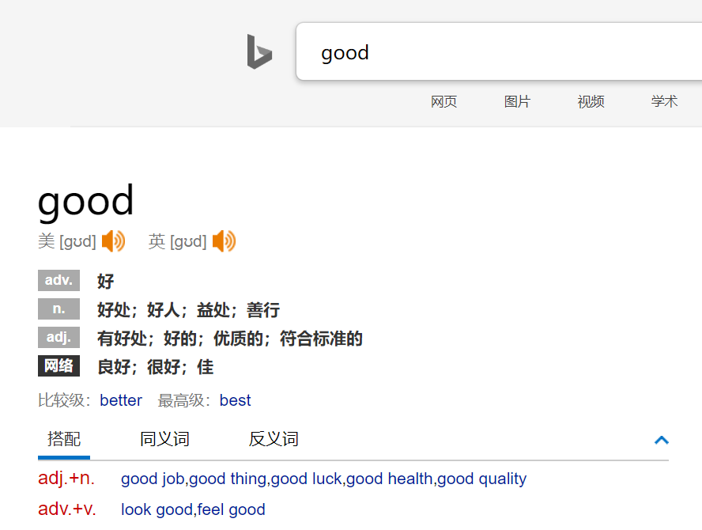
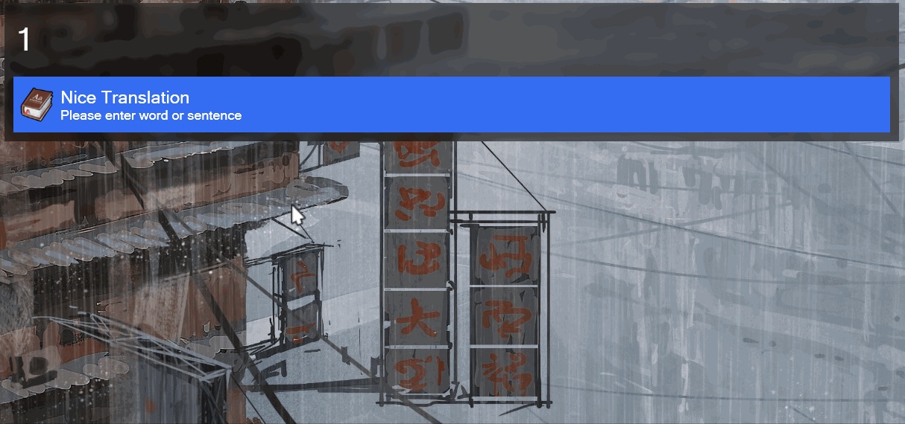

### A Dictionary/ Language Translation Plugin For Wox

### Dictionary

This feature is totally based on [Bing](https://cn.bing.com/dict) web site.

Dictionary for chinese and english:


refer to web site:




### Translation

Translate from your sentence to any other languages:



#### Enable It

Please fill the `appid` and `secretKey`  before you using the translation feature. You can get them on [Baidu translation open platform](http://api.fanyi.baidu.com/)，and apply the [General Translation API](http://api.fanyi.baidu.com/product/11) service.

Then open the plugin directory and edit the `main.py`, the settings will be at line 16-17:

``` python
appid = 'id'
secretKey = 'key'
```

Then you are good to go.

#### More Language?

By default, the plugin will translate the original sentence to `en/zh`, `jp`, `kor`.

You can decide what kind of languages you want as the target language by edting the `main.py` at line 21:

``` python
target_languages = [
    'zh', 
    'en',
    'jp', 
    'kor' 
]
```

You can add or remove languages in this setting with the language in [list](http://api.fanyi.baidu.com/doc/21).

